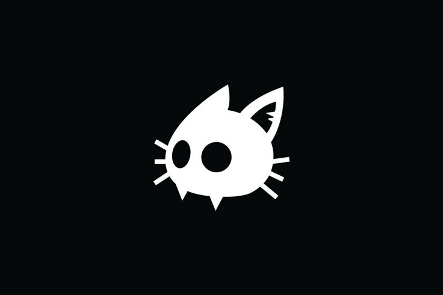

# DigitalKitty - Secure Digital Asset Management System


A self-hosted, privacy-focused digital asset management platform built for students, professionals, and organizations who want complete control over their digital files.

## Table of Contents
- [Project Overview](#project-overview)
- [Key Features](#key-features)
- [Technology Stack](#technology-stack)
- [Installation Guide](#installation-guide)
- [Usage Instructions](#usage-instructions)
- [System Architecture](#system-architecture)
- [Security Features](#security-features)
- [Future Roadmap](#future-roadmap)
- [Contributing](#contributing)
- [License](#license)
- [Acknowledgements](#acknowledgements)

## Project Overview

DigitalKitty is a full-fledged digital asset management system developed with a focus on:
- **Privacy-first design** - Your data remains yours
- **Modern architecture** - Built with cutting-edge technologies
- **Customizability** - Adaptable to various use cases

Unlike traditional cloud storage solutions, DigitalKitty empowers users to host their own secure file management system, eliminating dependency on third-party providers.

## Key Features

### Core Features
✅ **Secure Authentication** - JWT-based login system  
✅ **File Management** - Upload, organize, and retrieve various file types  
✅ **Role-Based Access** - Admin, Regular User, and Guest roles  
✅ **Self-Hosted Storage** - MinIO integration for private file storage  
✅ **Responsive Dashboard** - Clean UI for all devices  

### Advanced Features
🔹 Activity logs and usage tracking  
🔹 Secure file sharing with expiration  
🔹 File categorization and tagging  
🔹 Storage usage analytics  

## Technology Stack

### Frontend
- React.js
- Tailwind CSS
- Axios for API communication

### Backend
- Node.js
- Express.js
- Prisma ORM

### Database
- PostgreSQL

### Storage
- MinIO (S3-compatible object storage)

### Security
- JWT Authentication
- Bcrypt password hashing
- Role-Based Access Control

## Installation Guide

### Prerequisites
- Node.js (v16+)
- PostgreSQL
- MinIO server
- Git

### Setup Instructions

1. Clone the repository:
   ```bash
   git clone https://github.com/KarXAI/Karan_Singh_CSE-Ai-Ml-SecA_DigitalKitty.git
   cd Karan_Singh_CSE-Ai-Ml-SecA_DigitalKitty


2. Install dependencies:
  # Frontend
  cd frontend
  npm install

# Backend
  cd ../backend
  npm install

3. **Configure environment variables**:
Create .env files in both frontend and backend directories with required configurations.

4. **Database setup**:
  npx prisma migrate dev

5. **Start the development servers**:
  # Backend
  cd backend
  npm run dev

  # Frontend (in new terminal)
  cd frontend
  npm start

  
Usage Instructions
1.Registration: Create a new account with email and password

2.Login: Access your personalized dashboard

3.File Management:

  - Drag & drop files to upload
  - Organize files into folders
  - Share files with secure links
4. Admin Features (for admin users):
  - User management
  - System analytics
  - Storage configuration

**System Architecture
**DigitalKitty follows a three-tier architecture:
  **Frontend**: React-based user interface
  **Backend**: Node.js/Express API server
  **Data Layer:
**PostgreSQL for metadata**
**MinIO for file storage**

**Security Features**
  🔒 End-to-end encryption
  🛡️ JWT authentication with token expiration
  🚦 Role-based access control
  📝 Comprehensive activity logging
  🔍 Input validation and sanitization
  
**Future Roadmap**
  - AI-powered file categorization
  - Collaborative editing features
  - Mobile applications (iOS/Android)
  - Two-factor authentication
  - Cloud service integrations (Google Drive, Dropbox)

**Contributing**
  We welcome contributions! Please follow these steps:

  1. Fork the repository

  2. Create your feature branch (git checkout -b feature/AmazingFeature)

  3. Commit your changes (git commit -m 'Add some AmazingFeature')

  4. Push to the branch (git push origin feature/AmazingFeature)

  5. Open a Pull Request

  **License**
Distributed under the MIT License. See **LICENSE** for more information.

**Acknowledgements**
**KR Mangalam University
**
**Project Guide:** Mr. Sumit Kumar
Department of Computer Science & Engineering
All open-source contributors whose work made this project possible

**Demo Video**
https://drive.google.com/file/d/1Z9lYfU8Zt9h_NOd18nLlG8RmEHR4i6wc/view?usp=sharing
